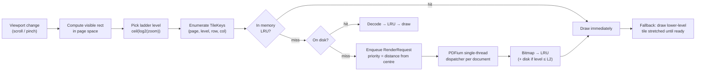
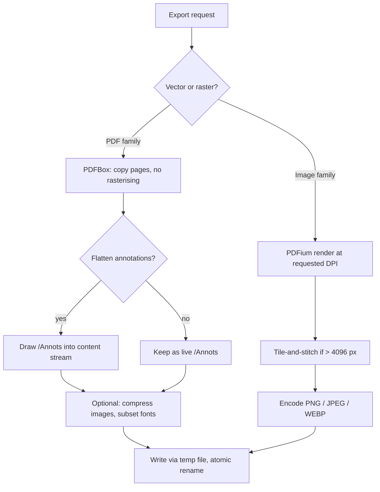

# Premium PDF Engine — Engineering Specification

**Status:** proposal, awaiting approval. No implementation started.
**Target module:** `:pdfengine` (new Gradle module), consumed by `:app`.
**Author's note:** every library claim below was verified against current sources, not recalled. Where something is not achievable on Android, this document says so instead of promising it.

---

## 0. Executive summary — read this first

You asked for 20 capability areas. Roughly **60% is achievable at high quality**, 25% is achievable with meaningful caveats, and **15% is not achievable on Android at any sane cost** and should be cut now rather than discovered in month nine.

The single most valuable thing in this whole brief, for *this* app, is not "be Acrobat." It is:

> **A tile-based renderer that stays razor sharp at 50× on an A0 shop drawing, with measurement tools calibrated to drawing scale, and revision comparison between Rev A and Rev B.**

That combination does not exist in a free Android app. It is directly aimed at what a core-wall QA/QC engineer does on site. Everything else in the brief is table stakes or luxury.

### Feasibility verdict

| # | Area | Verdict | Note |
|---|---|---|---|
| 1 | Rendering engine | ✅ Full | Requires replacing `android.graphics.pdf.PdfRenderer` with PDFium |
| 2 | Ultra zoom (50×, no blur) | ✅ Full | Tile pyramid; this is the flagship feature |
| 3a | Drawing / shapes / markup | ✅ Full | |
| 3b | **Edit existing PDF text** | ❌ **Cut** | See §3.2 — genuinely unsolved, Acrobat itself does it badly |
| 3c | Measurement + scale calibration | ✅ Full | Highest engineering value; snap-to-geometry is ⚠️ |
| 4 | Annotation system | ✅ Full | Upgrade to real PDF `/Annots`, not an overlay |
| 5a | Export PNG / JPEG / WEBP / PDF | ✅ Full | |
| 5b | Export TIFF | ⚠️ Cut | No Android encoder; multi-page PDF covers the use case |
| 5c | Export SVG | ❌ Cut | No viable PDF→SVG converter on Android |
| 5d | Export PDF/A | ❌ Cut | Conformance + validation is its own multi-month project |
| 6 | Extract pages | ✅ Full | |
| 7 | Merge PDFs | ✅ Full | |
| 8 | Replace page ranges | ✅ Full | |
| 9 | Crop area → new PDF | ✅ Full | Via CropBox, vector-preserving |
| 10 | Page organizer | ✅ Full | |
| 11a | OCR English | ✅ Full | Tesseract, not ML Kit |
| 11b | **OCR Arabic** | ⚠️ Hard | ML Kit has **no Arabic**; Tesseract Arabic quality on drawings is poor |
| 11c | Searchable-PDF output (Arabic) | ⚠️ High risk | RTL + shaping in an invisible text layer |
| 12 | Search engine | ✅ Full | Comes free with PDFium text layer |
| 13 | Compare PDFs | ✅ Full | Killer feature for drawing revisions |
| 14a | Drawn / image signature | ✅ Full | But it is a **picture**, not a signature — see §14 |
| 14b | Certificate signature (PAdES) | ⚠️ Scoped | Feasible; needs TSA + key management; do not half-build |
| 15a | Password / encryption / permissions | ✅ Full | |
| 15b | Watermark | ✅ Full | |
| 15c | **Redaction** | ⚠️ Danger | A black rectangle is not redaction — see §15 |
| 16 | 60 FPS performance | ✅ Full | Achievable; §16 gives the budget |
| 17 | Premium UI | ✅ Full | One caveat on glassmorphism, §17 |
| 18 | Clean modular architecture | ✅ Full | |
| 19 | Modern Android stack | ✅ Full | |

### What this costs

Honest estimate for one engineer working the way we have been working: **Phase 0–2 is the real product** and lands in a reasonable number of increments. Phases 3–5 roughly double it. The full 20-section brief as literally written is a team-year. The roadmap in §13 is ordered so that **you get a better PDF experience at the end of every phase**, and can stop at any phase boundary with something coherent.

---

## 1. Where we are today (the honest baseline)

`ui/pdf/PdfViewerScreen.kt`, 577 lines. It works, and it is the wrong foundation.

```
renderPage(renderer, lock, index, targetWidth = 2048)
  → Bitmap.createBitmap(2048, h, ARGB_8888)
  → page.render(bitmap, null, null, RENDER_MODE_FOR_DISPLAY)
```

Concrete limits, measured from the code:

| Problem | Cause | Consequence on an A1 drawing |
|---|---|---|
| **Blurry when zoomed** | One 2048 px-wide bitmap per page, magnified by the gesture | At 10× you are looking at 205 px of real data stretched across the screen. Rebar callouts become unreadable — the exact moment you need them |
| Zoom capped at 10× | `scale.coerceIn(0.5f, 10f)` | Cannot inspect a dimension string |
| ~24 MB per page | 2048 × 2896 × 4 bytes, ARGB_8888 | Two pages cached = OOM risk on a mid-range phone |
| One page at a time | `pageIndex` + single `produceState` | No continuous scroll, no thumbnails |
| No text layer | `PdfRenderer` exposes none | **No search, no selection, no copy** — architecturally impossible on this API |
| Global render lock | `PdfRenderer` is not thread-safe | Every render serialises behind the UI |
| Export rasterises | `exportAnnotatedPdf` draws bitmaps into a new `PdfDocument` | Text becomes pixels, file size explodes, result is not searchable |
| Annotations are an overlay | Room table `pdf_annotations`, drawn on top | Invisible in Acrobat, in email, to the consultant |

That last row matters commercially. Markup that only exists inside our app is markup the site engineer cannot send to anyone.

**Nothing above is fixable by polishing.** Items 1, 5, 6, 7 and 8 are properties of `android.graphics.pdf.PdfRenderer` itself.

---

## 2. Technology decisions

### 2.1 Rendering core → PDFium

**Decision: `io.legere:pdfiumandroid` (PdfiumAndroidKt), Apache-2.0, API 21+, actively released through 2025.**

| Candidate | Verdict |
|---|---|
| `android.graphics.pdf.PdfRenderer` (current) | ❌ No text layer. Ends the discussion |
| `androidx.pdf:pdf-viewer` | ❌ **Still alpha; runtime-gated to Android 15 (SDK 35)**. Our `minSdk` is 26. It is also a closed Fragment with no annotation or theming hooks — we would be embedding someone else's UI, which is the opposite of this brief |
| `barteksc/PdfiumAndroid` | ❌ Unmaintained since ~2017 |
| **`io.legere:pdfiumandroid`** | ✅ Maintained fork, Kotlin + coroutine API, `PdfTextPage` for text extraction, Apache-2.0 |
| PSPDFKit / Foxit SDK | ❌ Commercial licence, four/five figures per year |

**What PDFium buys us that we cannot otherwise have:** text extraction, text search, per-character bounding boxes (→ selection, highlight-that-follows-text, OCR skip detection), password-protected documents, form fields, and — critically — **rendering an arbitrary sub-rectangle of a page at an arbitrary scale**, which is the entire basis of tile rendering.

**Cost:** native `.so` per ABI. Budget **+6–10 MB** APK. Mitigation: ABI splits in CI, or ship an App Bundle. This is the single largest downside and it is worth it.

**Constraint to respect:** PDFium is not safe for concurrent calls into the same document. All PDFium work goes through **one dedicated single-thread dispatcher per open document**. This is not a performance problem — rendering is already I/O-bound per tile and we parallelise across *documents*, not within one.

### 2.2 Document surgery → PDFBox-Android

**Decision: `com.tom-roush:pdfbox-android:2.0.27.0`, Apache-2.0.**

Handles merge, split, extract, page replace, crop (CropBox), rotate, encrypt, permissions, watermark, real `/Annots` writing, and flattening. PDFium reads; PDFBox writes.

**Known risk, stated plainly:** last release was **January 2023** (PDFBox 2.0.27). It is not abandoned in the sense of broken — it is a stable port of a stable upstream — but it is not moving. Mitigations: it is Apache-2.0 and self-contained, so we can vendor and patch it if ever needed; and we confine it behind our own `PdfEditor` interface (§5) so replacing it later touches one file.

**Rejected: iText 7.** It is AGPL-3.0. Using it in a distributed app obliges you to release your entire application source under AGPL, or buy a commercial licence. Not a licensing risk we are taking silently.

**Memory rule:** every PDFBox `load()` uses `MemoryUsageSetting.setupTempFileOnly()`. A 300 MB drawing set must never be resident in heap.

### 2.3 OCR → Tesseract4Android

**Decision: `cz.adaptech.tesseract4android:tesseract4android:4.8.0`, Apache-2.0.**

**This is forced, not chosen.** ML Kit Text Recognition v2 supports Latin, Chinese, Devanagari, Japanese and Korean — **Arabic is not in the list.** For an Arabic-first app that is disqualifying, so ML Kit is out despite being the more convenient API.

Language data (`ara.traineddata` ≈ 15 MB, `eng.traineddata` ≈ 4 MB) is **downloaded on first use, not bundled** — otherwise every user pays 19 MB for a feature most will never touch.

**Set expectations honestly:** Tesseract on Arabic *print* is decent. Tesseract on **Arabic hand-annotated engineering drawings** is poor — rotated text, dense line-work, stamps and dimension leaders all defeat it. OCR should be positioned as "search inside scanned documents," not as a transcription tool.

### 2.4 Everything else

| Need | Choice | Why |
|---|---|---|
| Thumbnails / image loading | **Coil 3** — already a dependency | No new dependency |
| Persistence | **Room** — already at v13 | Migration path from `pdf_annotations` exists (§6.4) |
| Concurrency | **Coroutines + Flow** | Matches the whole app |
| DI | **Manual factory, no Hilt** | The app uses a service locator in `CoreWallApp`. Introducing Hilt for one module is a net loss |
| Certificate signing (Phase 5 only) | BouncyCastle `bcpkix-jdk18on` | Only library that can do PAdES on Android |

---

## 3. Rendering engine design

### 3.1 The tile pyramid — how "50× with no blur" actually works

The rule: **never magnify a bitmap.** If the user is at 12×, we do not stretch the 1× render — we ask PDFium to rasterise that region *at* 12×.

Doing that continuously would re-render on every pixel of pinch. So we quantise zoom onto a **power-of-two ladder** and render at the next step **at or above** the current zoom, then let the GPU scale *down* slightly. Downscaling is visually free; upscaling is what looks blurry.

```
Ladder:   L0=0.5×  L1=1×  L2=2×  L3=4×  L4=8×  L5=16×  L6=32×  L7=64×
User at 12.3×  →  render at L5 (16×)  →  composite at 12.3/16 = 0.77 scale  →  sharp
```

Each ladder level is cut into fixed **512 × 512 px** tiles. Only tiles intersecting the viewport (plus a one-tile prefetch ring) are ever rendered.



**The fallback line is what makes it feel instant.** While a sharp tile renders, we draw the already-cached coarser tile scaled up. The user sees a slightly soft image that snaps sharp within ~1 frame, never a white hole.

### 3.2 Memory budget

A 512×512 `ARGB_8888` tile = 1 MB. `RGB_565` = 0.5 MB.

- **PDF pages are opaque** — no alpha needed. Use **`RGB_565`** for tiles. Halves memory for no visible loss on line-work drawings.
- Cache size = `ActivityManager.memoryClass / 4`, clamped to **[32 MB, 192 MB]**. On a 256 MB-class device that is 64 MB ≈ **128 tiles** ≈ roughly four screenfuls at 1080p. Ample.
- Disk cache only for levels **L0–L2**. High-zoom tiles are cheap to regenerate and would thrash storage.
- Eviction: LRU, plus **hard-drop every tile of a ladder level more than 2 steps from current zoom**.

Compare with today: 24 MB for *one* page at fixed resolution, versus 64 MB holding four screens at *any* zoom.

### 3.3 "GPU acceleration" — what is real and what is not

The brief asks for GPU acceleration. Being straight with you:

**PDFium rasterises on the CPU.** There is no GPU PDF rasteriser available on Android short of writing one, which is a research project, not a feature.

What *is* real, and what we will do: tiles become `ImageBitmap`s composited by Compose/Skia, which **is** GPU-accelerated. Pan and zoom become pure texture transforms at 60–120 FPS with zero CPU rasterisation, because the pixels are already rendered. That delivers the *experience* the brief is asking for. Anyone claiming GPU-accelerated PDF rasterisation on Android is describing this same thing.

### 3.4 View modes

Single page · continuous vertical · continuous horizontal · double page (auto-enabled on tablets in landscape) · reading mode (chrome hidden, tap zones for page turn). All are the same `LazyColumn`/`LazyRow` over a `PageLayout` that computes page rects in a shared coordinate space — mode is a layout strategy, not five separate screens.

---

## 4. Zoom, gestures, navigation

| Gesture | Behaviour |
|---|---|
| Pinch | Continuous, anchored at the centroid, rubber-banded past limits |
| Double tap | Cycles fit-width → 100% → 200%, animated with the existing `Motion` tokens |
| Two-finger double tap | Zoom out to fit-page |
| Long-press + drag | Zoom to selection rectangle |
| **Smart zoom** | Double tap on a detected content block (from the PDFium text layer) zooms to that block's bounds — tap a title block, it fills the screen |
| Quick-scale (one-finger up/down after a tap) | Standard Android convention, works one-handed on a ladder |

Zoom range **0.25× – 64×**. Beyond 64× the ladder stops and we allow up to 100× by upscaling L7 — because beyond 64× you are looking at rasteriser noise, not data.

**Mini-map:** appears above 4× zoom, bottom-corner, shows the page thumbnail with a draggable viewport rectangle. Auto-hides after 2 s of no interaction. **Zoom percentage** shown next to it, tappable to open a preset menu (fit width / fit page / 100% / 200% / 400%).

---

## 5. Module & folder structure

```
:pdfengine                       ← new Gradle module, no dependency on :app
├── core/
│   ├── PdfDocumentHandle.kt     open/close, page count, page sizes, metadata
│   ├── PdfRenderCoordinator.kt  single-thread dispatcher per document
│   ├── tile/
│   │   ├── TileKey.kt           (docId, page, level, row, col) — value class
│   │   ├── TilePyramid.kt       ladder maths, visible-tile enumeration
│   │   ├── TileCache.kt         LRU memory + disk
│   │   └── RenderQueue.kt       priority queue, cancellation
│   └── text/
│       ├── TextLayer.kt         per-page chars + bounds from PDFium
│       └── SearchIndex.kt       incremental, cancellable
├── edit/
│   ├── PdfEditor.kt             INTERFACE — the only PDFBox seam
│   ├── ops/                     Merge, Extract, Replace, Crop, Rotate,
│   │                            Reorder, InsertBlank, InsertImage, Watermark
│   ├── AnnotationWriter.kt      our model → real PDF /Annots
│   └── Flattener.kt             annotations → page content stream
├── annotate/
│   ├── model/                   sealed Annotation hierarchy, Measurement, Calibration
│   ├── AnnotationStore.kt       Room-backed, undo/redo journal
│   └── HitTester.kt             selection, handles, z-order
├── ocr/            TesseractEngine, LanguagePackManager, SearchablePdfWriter
├── compare/        TextDiffer, VisualDiffer, DiffResult
├── export/         ExportPipeline, format encoders, DPI/quality options
└── ui/
    ├── viewer/     PdfViewer, PageLayout, TileCanvas, MiniMap
    ├── tools/      FloatingToolbar, ToolPalette, PropertyInspector
    ├── organizer/  PageGrid (drag/drop reorder)
    ├── compare/    SideBySide, OverlayDiff
    └── theme/      consumes :app design tokens via an interface, not a hard import
```

**Why a separate module:** it enforces that the engine cannot reach into `MainViewModel`. That is what makes it reusable, and it makes the build fail if someone violates it — which is stronger than a convention.

The engine ships its own minimal theme contract; `:app` supplies `Space`/`Radius`/`CwColors` through it, so the engine looks native to this app without depending on it.

---

## 6. Data model

```kotlin
// ---- identity & geometry -------------------------------------------------
@JvmInline value class DocId(val value: String)          // stable hash of path+mtime
data class PageInfo(val index: Int, val widthPt: Float, val heightPt: Float, val rotation: Int)

// All annotation geometry is stored in PDF POINT SPACE (72/inch), origin
// bottom-left, matching the PDF spec. NOT normalised 0..1, NOT pixels.
// Reason: point space survives zoom, rotation, crop and export unchanged,
// and it is what /Annots wants — so writing a real PDF annotation is a
// straight copy instead of a lossy conversion.
data class PointPt(val x: Float, val y: Float)
data class RectPt(val left: Float, val bottom: Float, val right: Float, val top: Float)

// ---- annotations ---------------------------------------------------------
sealed interface Annotation {
    val id: Long; val page: Int; val colorArgb: Long
    val createdAt: Long; val layer: String; val author: String

    data class Ink(val strokes: List<List<PointPt>>, val widthPt: Float, val tool: InkTool) : Annotation
    data class Shape(val kind: ShapeKind, val bounds: RectPt, val strokePt: Float, val fillArgb: Long?) : Annotation
    data class TextMarkup(val kind: MarkupKind, val quads: List<RectPt>, val quotedText: String) : Annotation
    data class FreeText(val bounds: RectPt, val text: String, val style: TextStyle) : Annotation
    data class StickyNote(val at: PointPt, val body: String, val replies: List<Reply>) : Annotation
    data class Stamp(val bounds: RectPt, val stampId: String) : Annotation
    data class Measure(val measurement: Measurement) : Annotation
}

enum class InkTool { PENCIL, MARKER, HIGHLIGHTER, BRUSH }
enum class ShapeKind { RECT, ELLIPSE, LINE, ARROW, POLYGON, CLOUD, FREEFORM }
enum class MarkupKind { HIGHLIGHT, UNDERLINE, STRIKEOUT, SQUIGGLY }

// ---- measurement (the engineering core) ----------------------------------
data class ScaleCalibration(
    val page: Int,
    val pixelsPerUnit: Float,      // derived from a user-drawn reference line
    val unit: LengthUnit,          // MM, CM, M, IN, FT
    val declaredScale: String,     // "1:50" as printed on the drawing, for the label
    val calibratedAt: Long
)

sealed interface Measurement {
    val calibrationId: Long
    data class Distance(val a: PointPt, val b: PointPt) : Measurement
    data class Polyline(val points: List<PointPt>) : Measurement    // running length
    data class Area(val points: List<PointPt>) : Measurement        // shoelace
    data class Angle(val vertex: PointPt, val a: PointPt, val b: PointPt) : Measurement
    data class Radius(val centre: PointPt, val edge: PointPt) : Measurement
}

// ---- tiles ---------------------------------------------------------------
@JvmInline value class TileKey(val packed: Long)   // doc:12 page:16 level:4 row:16 col:16

// ---- session (survives process death) ------------------------------------
data class ViewerSession(
    val docId: DocId, val page: Int, val zoom: Float,
    val scrollX: Float, val scrollY: Float,
    val viewMode: ViewMode, val activeLayers: Set<String>
)
```

### 6.1 Room schema additions (would be DB v13 → v14)

| Table | Purpose |
|---|---|
| `pdf_annotation_v2` | Replaces `pdf_annotations`. Point-space geometry, layer, author, JSON payload per subtype |
| `pdf_calibration` | Scale per page — a drawing set can mix 1:50 and 1:20 on different sheets |
| `pdf_measurement` | Measurements, FK to calibration |
| `pdf_bookmark` | User bookmarks (document outline is read live from PDFium) |
| `pdf_session` | Last position per document — reopen exactly where you left off |
| `pdf_ocr_page` | Per-page OCR text + status, so OCR runs once |

Any index declared here **must** appear in the migration with Room's generated name. `tools/check_room_schema.py` already enforces this in CI — it exists because getting it wrong crashed the app twice.

### 6.2 Migrating existing markup — non-negotiable

The current `pdf_annotations` table stores normalised `0..1` coordinates and a `tool` string. Users have real markup in there.

Migration converts each row: `pointPt = normalised × pageSizePt`. Page size comes from PDFium at migration time. If a file has since been deleted, the row is **kept, flagged orphaned, and hidden** — never silently dropped. Losing a site engineer's markup is worse than any feature we could add.

---

## 7. Editing engine architecture

### 7.1 Two things the brief calls "editing"

**(a) Annotation — adding a markup layer.** Fully supported, and upgraded: markup is written as **real PDF `/Annots`** via PDFBox. It stays non-destructive, is editable later, and — the whole point — **opens correctly in Acrobat on the consultant's desk.** Today's overlay does not.

**(b) Editing existing page text — "Edit Text, Font Family, Font Size…"**

This is being **cut**, and here is why, because it is the biggest single thing in the brief:

Text in a PDF is not a paragraph. It is a sequence of glyph-positioning operators inside a content stream, referencing a font that is usually **subset-embedded** — the file physically contains only the glyphs that were used. Change "20" to "25" and if the glyph `5` was never used on that page, it does not exist in the file. Re-flowing the surrounding line then requires re-running the original layout engine, which is gone.

Acrobat ships this feature and it is well known for producing mismatched fonts and broken spacing. Foxit and PDF Expert are the same. Nobody has solved it — and on engineering drawings, where text sits inside dimension leaders and title blocks, it would be *actively dangerous*: a QA/QC app must never let someone silently alter a dimension on a consultant's drawing.

**What we ship instead, which covers the real need:**
- **FreeText annotations** with full font/size/colour/bold/italic/underline/alignment/rotation — you can add text anywhere and re-edit *your own* text freely.
- **Redaction-and-replace** for the legitimate case: cover the old value with an opaque box and place a FreeText on top, recorded in annotation history as an explicit, attributable revision — not an invisible edit.

This is a deliberate scope cut, not an oversight. If you want (b) anyway after reading this, say so and I will build (a) first and we can revisit.

### 7.2 Undo / redo

A command journal, not state snapshots.

```kotlin
interface EditCommand { fun apply(); fun revert(); val label: String }
```

Every mutation — annotation, page op, calibration — is a command. Two stacks, capacity 100, persisted per session so undo survives rotation and process death. Page-level operations (delete page, reorder) sit on the same stack as annotations, which means **one Ctrl-Z model for the whole document** rather than the two disconnected histories most PDF apps have.

### 7.3 Measurement — the part that matters for this app

The workflow, designed around how a site engineer actually works:

1. **Calibrate once per sheet.** Tap the scale tool, drag along a known dimension (a gridline spacing, a printed dimension string), type the real value, pick the unit. Store as `ScaleCalibration`.
2. The app **cross-checks against the printed scale** ("1:50" in the title block, read from the text layer). If your calibration implies 1:47, it says so. Wrong calibration silently producing wrong quantities is the failure mode that matters.
3. Measure: distance, running polyline, area, angle, radius/diameter.
4. Every measurement persists as an annotation with a visible dimension label, exports with the PDF, and **can be linked to an element mark** (`T1-W4A`) through the existing `links` table — so a measured opening on a drawing connects to the wall it belongs to.

**Snap-to-geometry is marked ⚠️.** True snapping needs the page's vector paths, which means walking PDFium's path objects — feasible but slow on drawings with 100k+ path segments. Phase 2 ships snapping to *other annotations* and to a grid; vector snapping is deferred to a spike with a real drawing before we commit.

---

## 8. Export pipeline



**Options exposed:** page selection (all / current / range / custom) · DPI (72–600) · quality · background (white / transparent, PNG+WEBP only) · annotations (include / flatten / exclude / **annotations-only**) · greyscale.

Two non-obvious decisions:

- **`ExportSpec` never rasterises when it does not have to.** Exporting a page range as PDF is a page-copy, so text stays selectable and the file stays small. Today's export rasterises everything — that is a bug we are fixing, not a feature we are keeping.
- **"Annotations only"** exports as **XFDF**, the Adobe interchange format, in addition to a transparent PNG. XFDF means the consultant can load your markup onto *their* copy of the drawing. For a QA/QC workflow that is more useful than any image.

**Large-page guard:** an A0 sheet at 600 DPI is 19866 × 28087 px ≈ 2.2 GB as a bitmap. The pipeline renders in horizontal bands and streams straight to the encoder, never allocating the full image. Above a computed limit the UI refuses and proposes the highest safe DPI rather than crashing.

---

## 9. Page operations

All PDFBox, all sharing one `PageOperation` interface so the organizer, the merge wizard and the AI agent all drive identical code.

| Operation | Notes |
|---|---|
| Merge | Unlimited files, drag-to-reorder, per-file page selection, preview |
| Extract | Single / multiple / ranges / **odd / even** / current selection → new PDF |
| Replace range | `Target p20–30 ← Source p5–15`. **Count mismatch is detected and surfaced** ("replacing 11 pages with 11 — ok" vs "with 8 — 3 pages will be removed"), with preview and a single undo |
| Crop → new PDF | Drag a rectangle; sets `CropBox`, so it is **vector-preserving and lossless**, not a screenshot. Multi-page and multi-region supported. "Smart crop" detects the drawing frame from the content bounding box |
| Organizer | Grid of thumbnails: drag reorder, delete, duplicate, rotate, split-here, insert blank / image / PDF, reverse, select-all-odd/even |

`Replace` and `Crop` are the two most-requested and least-implemented features in free Android PDF apps. They are also cheap for us because they are pure PDFBox. Good value.

---

## 10. Search, OCR, compare

**Search** rides the PDFium text layer: incremental across pages, cancellable, results as page + quad list so hits highlight in place. Case-sensitive and whole-word toggles. Regex is behind a "power" toggle, off by default — a bad regex on a 1000-page document is a UI freeze waiting to happen, so it runs with a match budget and a timeout.

**OCR** runs only on pages where the text layer is empty — a page that already has text never gets OCR'd. Runs in a foreground service with a progress notification (a 200-page scan is minutes, not seconds), writes to `pdf_ocr_page`, and immediately makes those pages searchable *in-app*. Producing a genuinely searchable *PDF file* with an Arabic invisible text layer is Phase 4 and flagged high-risk: RTL ordering and glyph shaping in an invisible layer are exactly where this goes wrong.

**Compare** ships two modes:
- **Text diff** — extract both text layers, LCS diff, colour insertions/deletions.
- **Visual diff** — render both at a fixed ladder level, compare tiles, produce a difference mask. Shown as side-by-side (synchronised pan/zoom) or as an overlay with old in red / new in blue.

For revision control on shop drawings — *what changed between Rev C and Rev D?* — visual diff is the one that earns its keep. This is the second-most-valuable feature in the brief after zoom.

---

## 11. Security, signatures — and two honest warnings

**Straightforward:** open password-protected files (PDFium), set user/owner passwords and AES encryption, set permission flags (print / copy / modify), apply watermarks (text or image, per-page or all, with opacity and rotation).

### ⚠️ Warning 1 — "Redaction"

Drawing a black rectangle over text is **not** redaction. The text is still in the content stream and any tool extracts it in seconds. Apps that ship a black-box tool labelled "redact" are creating a security incident with a friendly icon.

Real redaction means removing the glyphs from the content stream and re-writing the page. We will implement it **properly or not at all**, and until it is proper the tool will be labelled **"Cover"** so nobody mistakes it for redaction.

### ⚠️ Warning 2 — "Signature"

Two completely different things share one word:

- **Drawn / image signature** — a picture of a signature stamped on the page. Trivial to implement, trivial to forge, legally near-worthless. Fine for "I reviewed this."
- **Certificate signature (PAdES)** — a cryptographic hash of the document signed with a private key, optionally timestamped by a TSA. This is what proves a document was not altered.

The UI must never let these look like the same feature. Phase 5 delivers drawn signatures first (labelled as such) and treats PAdES as a separate, deliberate piece of work: PKCS#12 import, Android Keystore, RFC 3161 timestamping, and verification UI. A half-built certificate signature is worse than none — it makes people trust a document they should not.

---

## 12. Performance & UI

### 12.1 Frame budget (60 FPS = 16.6 ms)

| Work | Budget | How |
|---|---|---|
| Compose recomposition | < 4 ms | Tile state in a `SnapshotStateMap` keyed by `TileKey`; a new tile recomposes one tile, not the page |
| Draw / composite | < 6 ms | `drawImage` with a transform; no per-frame allocation in `DrawScope` |
| Gesture handling | < 1 ms | Pure maths, no I/O |
| **PDFium rasterising** | **0 ms on the UI thread** | Always on the document dispatcher |
| Headroom | ~5 ms | |

Non-negotiable rules: no `Bitmap` allocation during scroll (pool and reuse tile bitmaps); no `runBlocking` anywhere in `:pdfengine`; every render request carries a `Job` cancelled the moment its tile leaves the prefetch ring; annotation hit-testing uses an R-tree, not a linear scan, above 200 annotations per page.

**Verification, not assertion:** Macrobenchmark scroll/zoom traces on a real 1000-page document and a real A0 sheet, run in CI, with jank percentage as the gate. Claiming 60 FPS without a trace is how the last "smooth" viewer ended up dropping frames.

### 12.2 UI

Floating glass toolbar, contextual property inspector on selection, bottom sheets for page/tool pickers, thumbnail rail, mini-map, full dark/light, adaptive across phone / tablet / foldable using the existing 600 dp breakpoint from `AppShell`.

**One caveat on glassmorphism, since the brief asks for it explicitly:** real blur (`RenderEffect`) is **API 31+** and costs GPU time per frame — over a continuously re-rendering tile canvas that is exactly where the frame budget dies. Plan: blur on API 31+ **only when not actively scrolling or zooming**, and a solid high-contrast surface at 92% opacity otherwise. It looks nearly identical and never costs a frame. On API 26–30 it is always the solid surface.

Contrast rules from the existing design system carry over unchanged — a toolbar floating over a white drawing must still pass 4.5:1, which pure glassmorphism frequently fails.

---

## 13. Roadmap

Ordered so **every phase ends with something better in your hands**, and any phase boundary is a valid stopping point.

| Phase | Delivers | Ends with |
|---|---|---|
| **P0 — Foundation** | `:pdfengine` module, PDFium integration, tile pyramid, caches, render queue, new viewer replacing `PdfViewerScreen`, existing annotations migrated | **Sharp at 50×, instant on 1000 pages.** The single biggest win |
| **P1 — Navigation** | Text layer, search, selection + copy, thumbnails, outline, bookmarks, all view modes, mini-map, session restore | A viewer that beats every free app on Play |
| **P2 — Markup & measure** | Real `/Annots`, full tool set, layers, undo/redo, **scale calibration + measurement**, XFDF export | The engineering product. Markup opens in Acrobat |
| **P3 — Document ops** | Organizer, merge, extract, replace, crop-to-PDF, full export pipeline | Complete document control |
| **P4 — Intelligence** | Compare (text + visual), OCR, searchable output | Revision comparison — the differentiator |
| **P5 — Security** | Passwords, permissions, watermark, drawn signatures; proper redaction and PAdES **only if scoped separately** | Enterprise checkboxes |

**Recommendation: approve P0 and P1 now.** They are the foundation everything else needs, they carry the least uncertainty, and they fix the problem you actually have today — drawings that go blurry exactly when you zoom in to read them. Decide on P2+ once you have used P1 on site.

---

## 14. Risk register

| Risk | Severity | Mitigation |
|---|---|---|
| **APK grows 6–10 MB (PDFium ABIs)** | High | ABI splits in CI; measure before/after and report the real number |
| **PDFBox-Android unmaintained since Jan 2023** | Medium | Apache-2.0 and vendorable; isolated behind `PdfEditor` so replacement touches one file |
| **OOM on A0 / 200 MB files** | High | Tiles + `RGB_565` + banded export + `setupTempFileOnly()`; test with a real A0 drawing before P0 ships |
| **Arabic OCR quality on drawings** | High | Position as search-assist, never transcription; show confidence; never feed OCR text to the AI as fact |
| **Losing existing user markup in migration** | **Critical** | Orphan-and-flag, never delete; migration dry-run logged; the CI schema guard already covers the DB side |
| **PDFium thread-safety violation → native crash** | High | One dispatcher per document, enforced by making the raw handle private to `PdfRenderCoordinator` |
| **Scope: 20 sections is a team-year** | **Critical** | The phase gates above. This is the risk most likely to actually bite |
| Regex search freezing the UI | Low | Match budget + timeout + cancellation |
| Glassmorphism costing frames | Medium | Blur only when idle, API 31+ only |

---

## 15. Future enhancements (explicitly out of scope now)

Form filling (AcroForm) · redlining workflow with consultant round-trip · cloud sync of annotation layers · **linking a measurement directly to a bar-count entry** so measured lengths feed the existing steel calculator · AI-assisted drawing reading using the sharp tiles we now have (feed a *zoomed, cropped region* to the model instead of a whole downscaled page — this would materially improve the document analysis you are already using) · handwriting recognition on site notes · DWG support (still closed-format; DXF remains the path).

That measurement→steel-calculator link and the AI tile-cropping idea are the two that would compound with what this app already does. Worth remembering when P2 lands.

---

## 16. What I need from you to start

1. **Approve or amend the cuts** in §0 — particularly §7.1 (no editing of existing PDF text). That is the one place I am arguing against the brief.
2. **Confirm the phase scope.** My recommendation is P0 + P1.
3. **One real file for testing** — the largest, ugliest A0 shop drawing you have. Every performance number in this document is an estimate until it has been run against a real drawing, and I would rather find the problems in week one.
